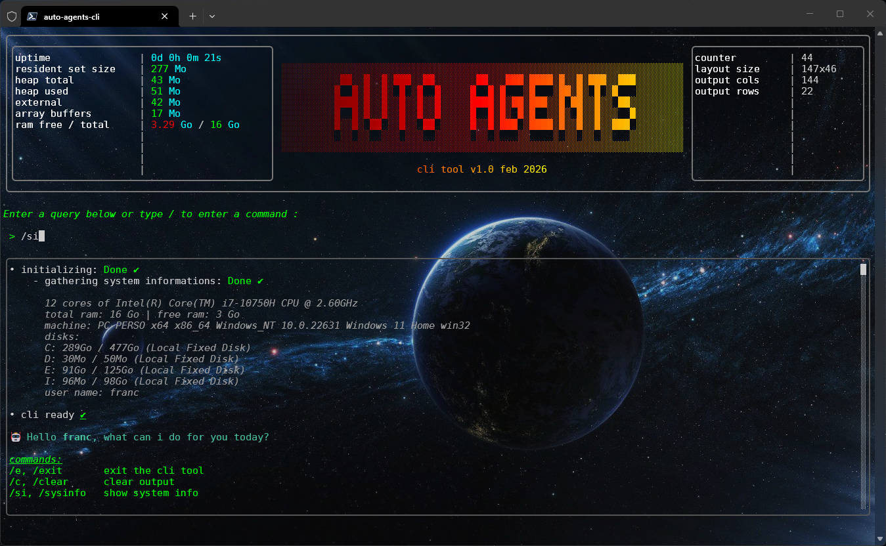

<table>
<tr>
<td>
<h1>Auto Agents</h1>

*&gt; software agents & agents workflows orchestrator. Fully generated by IA. Includes AI Agent*

---

</td>
<td>

</td>
</tr>
</table>

<!---------------------------------------------------------------------->
<!---------------------------------------------------------------------->
<!---------------------------------------------------------------------->

---

## 🤖 AI-Powered Software Agent Generator

Build, generate, and run **intelligent software agents** with a clear, production-ready architecture.

This project introduces a **unified model for AI-generated software agents**, designed to turn high-level specifications into fully functional, autonomous code. At its core, the `agent-model.md` file acts as both a **formal agent definition** and the **primary prompt** used by AI to generate consistent, reliable agent implementations.

### 🧠 From Idea to Autonomous Agent

Instead of handcrafted, one-off scripts, this project lets you define **what an agent is and how it behaves**, then automatically generate agents that:

* run autonomously or under human control
* follow a standardized lifecycle (start, pause, resume, stop)
* log every action with timestamps and severity levels
* track performance and execution time
* expose clear execution states and errors
* operate in fully isolated processes

Every agent execution is reproducible, auditable, and traceable.

### ⚙️ Built for Orchestration and Scale

The architecture is designed for **modern automation and orchestration workflows**:

* Node.js runtime with isolated agent processes
* IPC-based command and control
* One-run-per-process model with unique UUIDs
* Clean separation of input, output, configuration, logs, and metrics

Agents are easy to compose, monitor, restart, or integrate into larger pipelines.

### 🌍 International-Ready by Design

All logs and messages are **fully translatable**, with language selection handled dynamically via configuration or environment variables.
This makes the platform ideal for **enterprise, multi-region, and multi-language environments**.

### 🚀 Why This Project?

Because AI agents should be:

* **Predictable**, not opaque
* **Reusable**, not disposable
* **Observable**, not silent
* **Generated**, not handcrafted

This project provides a **solid foundation for AI-driven agent generation**, enabling you to create agents that process files, automate workflows, collaborate with other agents, and scale within orchestrated systems.

<!---------------------------------------------------------------------->
<!---------------------------------------------------------------------->
<!---------------------------------------------------------------------->

<table>
<tr>
<td colspan="2">
This project includes the repositories described below:
</td>
</tr>

<tr>
<td>
<a href="https://github.com/auto-agents/agents"><b>&bull; agents</b></a>
  
This repository contains:
<ul>
<li>the base agent and commons agents implementation</li>
<li>the <b>AI materials</b> that are used to generate the softwares (defining how agents are specified, generated, executed, and managed)</li>
</ul>
</td>
<td>

</td>
</tr>

<tr>
<td>
<a href="https://github.com/auto-agents/agents"><b>&bull; agents-cli</b></a>
  
This repository contains the <b>Auto Agents CLI tool</b>
</td>
<td>

</td>
</tr>

<tr>
<td>
<a href="https://github.com/auto-agents/modules"><b>&bull; modules</b></a>
  
This repository contains some plateform specific software modules for both <b>agents</b> and the <b>cli tool</b>:

- [speech](https://github.com/auto-agents/modules/speech/README.md)
- voice recognition

</td>
<td>

</td>
</tr>

</table>
