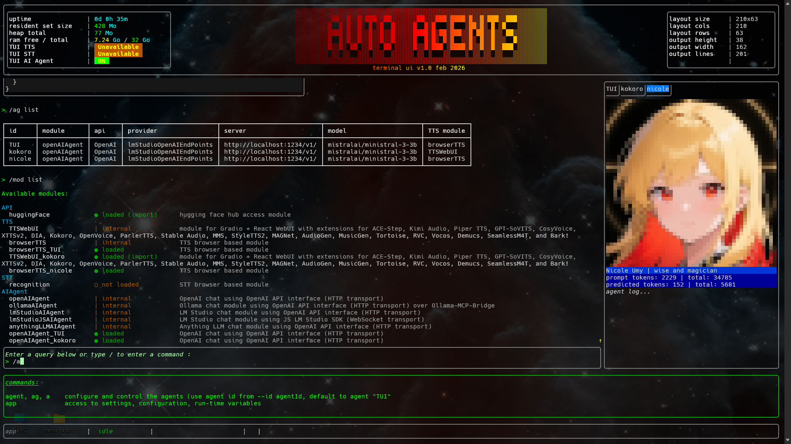

<table>
<tr>
<td valign="top">
<h1>Bulbing&nbsp;Bots</h1>

LLM&nbsp;Agents&nbsp;Framework&nbsp;and&nbsp;tool

---
<table>
<tr>
<td valign="top">

- multi agents
- sub agents
- voice agents
- avatars
- agent collaboration
  
</td>

<td valign="top">

- commands
- batches
- tools
- skills
- sessions
- memory
- plugins

</td>

</tr></table>

</td>
<td>

*agent **TUI** - helpful & sympathic assistant*

</td>
</tr>

<tr>
<td colspan="2"></td>

</tr>

</table>

<!---------------------------------------------------------------------->
<!---------------------------------------------------------------------->
<!---------------------------------------------------------------------->

---

## 🤖 multi purpose AI workers

<!---------------------------------------------------------------------->
<!---------------------------------------------------------------------->
<!---------------------------------------------------------------------->

<table>
<tr>
<td colspan="2">

### Repositories:

</td>
</tr>

<tr>
<td>

<h4><a href="https://github.com/auto-agents/cli"><b>&bull; cli</b></a></h4>

This repository contains the **CLI** and **TUI** tool</b>
</td>
<td>

</td>
</tr>

<tr>
<td colspan="2">

<a href="https://github.com/auto-agents/plugins"><b><h4>&bull; plugins</h4></b></a>

This repository contains **software plugins** for **cli tool**, that allows to add new features and capabilities to the **CLI** and to any **agent**. Any plugin can be load or unload on demand. A plugin can expose its functionnalities to the cli and agents in 5 different ways:

- plugins (core functionnalities and libraries)
- commands
- tools
- skills
- prompts

#### TTS

- [tts-browser](https://github.com/auto-agents/plugins/blob/main/speech) : **Text To Speech** with any browser implementing `WebSpeechAPI`
- [tts-webui](https://github.com/auto-agents/plugins/blob/main/src/TTS/tts-webui) : supports **Text To Speech** from softwares that can be installed in **`TTS WebUI`** [https://github.com/rsxdalv/TTS-WebUI](https://github.com/rsxdalv/TTS-WebUI), throught the **Gradio** API. Currently the following TTS providers are available in *auto-agents* :
    - **Kokoro TTS**
    - **Kitten TTS**
    - **OpenVoice V1**
    - **OpenVoice V2**
    - **ChatterBox**
    - **XTTS**
  
#### STT

- voice recognition : *Speak To Text* with any browser implementing `WebSpeechAPI` *(coming soon)*

#### API

- [Hugging Face](https://github.com/auto-agents/plugins/blob/main/src/API/hugging-face/exports/) : access to **hugging face API**, get model cards and allow to search the huge hugging face dabatabase for detailed informations about **models**

#### WEB

- [Puppeteer](https://github.com/auto-agents/plugins/tree/main/src/WEB/puppeteer-browser/exports) : the browser chromium/firefox commander plugin, that allows to control a browser and use it as a tool & skill for agents. It includes the following features :
    - google search
    - page scraper

</td>
</tr>

<tr>
<td colspan="2">

<a href="https://github.com/auto-agents/instruct"><b><h4>&bull; instruct</h4></b></a>

This repository contains various **AI instructions** for both **agents** and the **cli tool**:

- `prompts`
- `system instructions`
- `cli batches`
- `skills`

</td>
</tr>

<tr>
<td colspan="2">

<a href="https://github.com/auto-agents/shared"><b><h4>&bull; shared</h4></b></a>

This repository contains the core framework librairies & components shared accross the projects

</td>
</tr>

</table>

---

*this software is copyrighted by Franck Gaspoz, since January 2026, under the **GNU GENERAL PUBLIC LICENSE Version 3, 29 June 2007** (see file [LICENCE](LICENSE))*

picture credit: [https://raphaelai.org/](https://raphaelai.org/)
