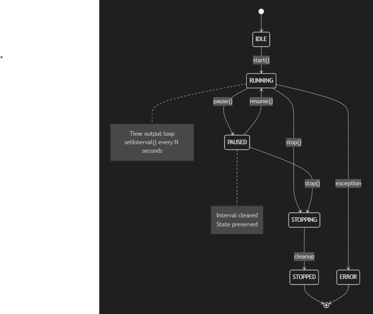

<table>
<tr>
<td>
<h1>Auto Agents</h1>

*&gt; software agents & agents workflows orchestrator. Fully generated by IA. Includes AI Agent*

---

**This organizations contains the repositories below:**
</td>
<td>

</td>
</tr>

<tr>
<td>
<a href="https://github.com/auto-agents/agents"><b>&bull; agents</b></a>
  
This repository contains:
<ul>
<li>the base agent and commons agents implementation</li>
<li>the <b>AI materials</b> that are used to generate the softwares</li>
</ul>
</td>
<td>

</td>
</tr>

<tr>
<td>
<a href="https://github.com/auto-agents/agents"><b>&bull; agents-cli</b></a>
  
 
This repository contains the <b>Auto Agents CLI tool</b>
</td>
<td>
</td>
</tr>

</table>
